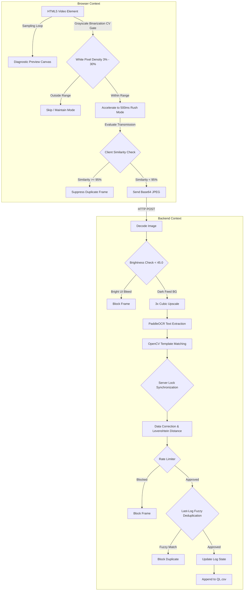

# FragEngine (V0.14.3)

[](https://github.com/PraharshaVyasaraj/FragEngine/actions/workflows/tests.yml)

A high-performance, real-time telemetry extraction engine for streaming gameplay video feeds, developed as a subset of the **FragLab Analytics** suite. Built as a hybrid system with a lightweight Google Chrome Side Panel frontend and a local PyTorch Flask backend, this engine extracts, normalizes, and filters BGMI/PUBG Mobile kill feed events with sub-33ms event detection latency.

---

## 🎨 Frontend UI Theme & Glassmorphic Dashboard

While the backend is verified by automated Headless CI suites, the client-side diagnostic panel is built with a premium, custom-designed frontend system:
* **Glassmorphism Design System**: High-fidelity CSS3 side panel with translucent background backdrops, responsive grid layouts, and custom-tuned tactical copper/bronze highlights (`#bfa15f`, `#d35400`).
* **Visual State Overrides**: Displays real-time operational metrics, density status counters, and dynamic previews of the binarization mask.
* **1Hz Preview Throttling**: The visual base64 canvas rendering loop is throttled to exactly 1Hz during idle monitoring to save browser IPC bandwidth, preventing DOM lags.
* **Live Status Diagnostics**: Visually updates to show `SUSPENDED` (when feed is silent), `MONITORING` (active evaluation), and `RUSH` (event detected).

---

## 🏗️ Pipeline Architecture Design




---

## ⚡ Key Optimizations in V0.14.3

* **Grayscale Binarization-First Detection**: Replaced the desaturated-vulnerable saturation gate with an 8-bit binarization density validator (threshold 180, active density range 3%–30%) on the canvas pixel buffer.
* **Client-Side Similarity Suppression**: Automatically compares binarized mask hashes on the client. Blocks duplicate frame transfers when the feed is static, saving **60%+ server CPU load**.
* **Thread Lock Synchronization**: Enforces a global `server_lock` on the Flask process, synchronizing dictionary corrections, rate limiters, and file logs to prevent parallel write race conditions.
* **400ms Event Limiter**: Blocks any logged events occurring within less than 0.400 seconds of each other.
* **Last-Log Fuzzy Matching**: Removes strict cooldown timers in favor of state-based comparison against the immediately preceding log. Prevents teammates with identical clan tags from blocking each other's sequential events.
* **Auto-Calibration Padding**: Automatically expands manual crop selections by 20 pixels horizontally to prevent player name clipping on long tags.

---

## 🛠️ Getting Started

### 1. Requirements & Dependencies
Ensure Python 3.10+ is installed. Install PyPI dependencies:
```bash
pip install -r requirements.txt
```

### 2. Run the Telemetry Server
Start the Flask engine:
```bash
python server.py
```

### 3. Load the Extension
1. Open Chrome and navigate to `chrome://extensions/`.
2. Enable **Developer Mode** (top right).
3. Click **Load unpacked** and select the `chrome_extension/` directory.
4. Draw your crop coordinates and click **Start Ingest**.

---

## ⚔️ The "Developer's Scars" (Build History)
This repository contains a commit log reflecting the real, incremental struggles of building high-frequency vision systems.
* Past failing runs (marked by red crosses) capture the process of debugging compiler variables, dependency versions, and environment constraints.
* The latest green checkmark guarantees stable, verified integration on standard PyPI configurations.

---

## 🏷️ Version History & Git Flow

We maintain explicit releases using Git tags. The version history log is preserved inside the `version_history/` directory:

- **V0.1** ([v0.1_history.md](version_history/v0.1_history.md)): Initial release.
- **V0.11** ([v0.11_history.md](version_history/v0.11_history.md)): Stage 1 Python diff gate & 30 FPS pipeline.
- **V0.12** ([v0.12_history.md](version_history/v0.12_history.md)): High-performance browser diff gate & dictionary correction.
- **V0.13** ([v0.13_history.md](version_history/v0.13_history.md)): Side Panel Diagnostics & Auto-Lock ROI.
- **V0.14** ([v0.14_history.md](version_history/v0.14_history.md)): Grayscale density CV, Thread Locks, and Similarity checks.
