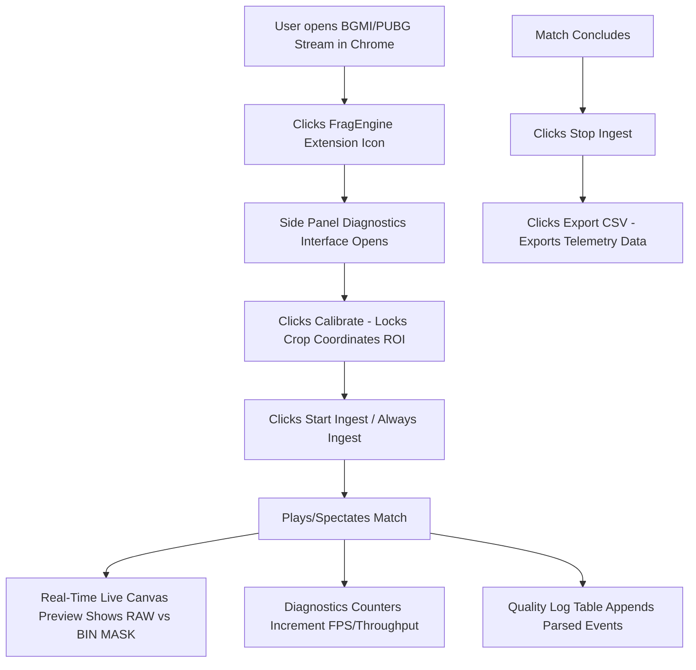
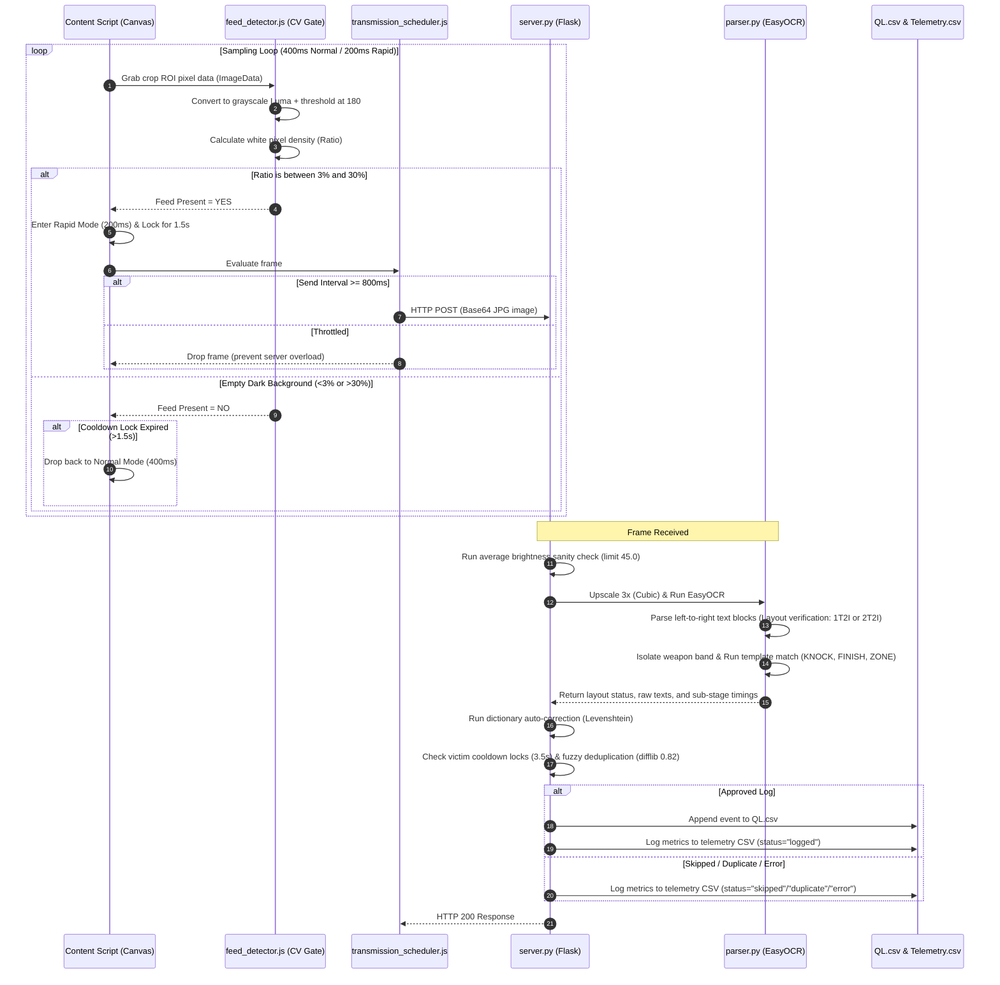

# FragEngine Maintenance & Release Operations Guide

This document is the single source of truth for the FragEngine repository. It maps directory architectures, enumerates system variables/constants, details output file schemas, specifies the technology stack, displays workflow pipelines, and defines the mandatory checklists required for release management.

---

## 1. Directory Structure Map

```
FragEngine/
├── chrome_extension/               # Client-Side Extension Module (V0.14+)
│   ├── manifest.json               # Extension configuration & permission gates
│   ├── background.js               # Service worker (manages lifecycle & sidepanel)
│   ├── content.js                  # Injects canvas frames and interacts with video
│   ├── feed_detector.js            # Binarization density checks (white pixels 3-30%)
│   ├── sampling_engine.js          # State machine loop (NORMAL/RAPID/IDLE states)
│   ├── transmission_scheduler.js   # POST transmission throttling (800ms limit)
│   ├── popup.html                  # Diagnostic dashboard interface
│   ├── popup.js                    # UI update controller & local binarization preview
│   └── popup.css                   # Custom glassmorphism UI styles
│
├── backend/                        # Telemetry, WMI Sampling & Helper Utilities
│   ├── __init__.py                 # Packages backend module
│   └── telemetry.py                # TelemetryCollector: hardware & latency logs
│
├── data/                           # Ingested Game Session Outputs
│   └── sessions/                   # Unique capture directories (SESSION_XXXX/)
│       ├── QL.csv                  # Parsed events log (layout, players, icons)
│       ├── v0.14_telemetry.csv     # Telemetry log (CPU, GPU, RAM, latencies)
│       └── v0.14_summary.json      # Aggregated performance metadata
│
├── version_history/                # Changelogs and Version Timelines
│   ├── v0.11_history.md
│   ├── v0.12_history.md
│   ├── v0.13_history.md
│   └── v0.14_history.md
│
├── tests/                          # Automated Regression Test Suites
│   ├── test_easyocr.py             # OCR character recognition confidence verification
│   ├── test_pipeline.py            # End-to-end parser tests
│   └── test_segment.py             # Crop ROI boundary checks
│
├── server.py                       # Flask server engine endpoint
├── parser.py                       # EasyOCR & template matching pipeline
├── DEV_NOTE.md                     # Brutal honesty dev notes & performance baselines
└── RELEASE_CHECKLIST.md            # This operational guide
```

---

## 2. Tuned System Parameters & Thresholds (State Variables)

These are the exact numerical parameters and logic gates built into the system:

### A. Browser Extension Constants
* **`NORMAL_INTERVAL_MS = 400`**: Idle state sampling interval (2.5 FPS). Gated to capture the onset of short-duration (600ms) events.
* **`RAPID_INTERVAL_MS = 200`**: Burst sampling interval (5.0 FPS) during active fight sequences.
* **`RAPID_LOCK_DURATION_MS = 1500`**: Cooldown lock window (1.5 seconds). Bypasses state transition lag by keeping the engine in Rapid Mode between consecutive events under 1.5s.
* **`SEND_INTERVAL_MS = 800`**: Frame send rate throttle (maximum 1.25 FPS) to avoid server-side GPU/CPU congestion.
* **`BINARIZATION_THRESHOLD = 180`**: Cutoff value for local canvas grayscale filtering (0-255). Values $\ge 180$ turn white (`255`), others turn black (`0`).
* **`DENSITY_MIN = 0.03` (3%)**: Minimum ratio of white pixels in the cropped ROI to declare the kill feed present.
* **`DENSITY_MAX = 0.30` (30%)**: Maximum ratio of white pixels. Filters out full-screen flashes and map background noise.
* **`lastPreviewTime`**: Time-tracking variable used to cap base64 image broadcasts to `popup.js` at exactly **1Hz** to preserve DOM rendering performance.

### B. Backend Server & Parser Constants
* **`EXPECTED_BG_MAX_BRIGHTNESS = 45.0`**: Maximum average grayscale value of the crop ROI allowed to pass the brightness pre-filter.
* **`MIN_NAME_LENGTH = 3`**: Discards parsed text blocks under 3 characters to prune OCR crop artifacts.
* **`SequenceMatcher(similarity >= 0.82)`**: Fuzzy text matcher metric for victim duplicates.
* **`cooldown expiry duration = 3.5 seconds`**: Time-lock window preventing identical victim/action rows from registering twice.
* **`BINARIZATION_THRESHOLD = 180`**: OpenCV thresholding value used before icon template matching.

---

## 3. Telemetry, CSV & File Schema Details

We enforce structural schema conformity for all database writes:

### A. Quality Log CSV Schema (`QL.csv`)
An unheaded piped-format file:
```
Log [counter] | [layout: 1T2I or 2T2I] | [T1 Name] | [I1 Action: Weapon/Zone] | [I2 Outcome: KNOCK/FINISH] | [T2 Victim Name]
```

### B. Telemetry CSV Schema (`v0.14_telemetry.csv`)
Logged at every processed Flask frame request:
```
Timestamp,CPU_Percent,RAM_MB,GPU_Percent,Threads,Vol_Ctx,Invol_Ctx,Decode_ms,Preprocess_ms,OCR_ms,IconMatch_ms,DictCorrection_ms,Total_Latency_ms,OCR_Confidence_Avg,Avg_Levenshtein_Dist,Dict_Hits,Suppressed_Duplicates
```

### C. Session Summary JSON Schema (`v0.14_summary.json`)
```json
{
  "session_directory": "path/to/session",
  "exported_at": "YYYY-MM-DD HH:MM:SS",
  "total_events_processed": 0,
  "total_dictionary_corrections": 0,
  "total_duplicates_blocked": 0,
  "server_lifetime_minutes": 0.0,
  "active_ingest_minutes": 0.0,
  "effective_fps_received": 0.0,
  "throughput_events_per_min": 0.0,
  "total_requests_received": 0,
  "total_events_logged": 0,
  "average_ocr_confidence": 0.0,
  "average_levenshtein_distance": 0.0,
  "hardware": {
    "cpu_avg": 0.0,
    "cpu_peak": 0.0,
    "ram_avg_mb": 0.0,
    "ram_peak_mb": 0.0,
    "gpu_avg": 0.0,
    "gpu_peak": 0.0
  },
  "average_latencies_ms": {
    "decode": 0.0,
    "preprocess": 0.0,
    "ocr": 0.0,
    "icon_match": 0.0,
    "dict_correction": 0.0,
    "total": 0.0
  }
}
```

---

## 4. Physical Files & Artifacts Under Management

We maintain a strict partition of project directories, local workspace files, and diagnostic scripts:

### A. Workspace Project Files (`E:\Games Data\SAMPLE_IMAGESET_FEED\`)
* **`server.py`**: Handles incoming HTTP POST requests, filters duplicate events via victim cooldown maps, and writes telemetry logs containing status labels.
* **`parser.py`**: Performs cubic 3x image scaling, EasyOCR text parses, horizontal band template segmentation, and returns latency profiling data.
* **`RELEASE_CHECKLIST.md`**: This guide (directory mapping, constants, checklists, user workflows).
* **`DEV_NOTE.md`**: Active performance journal recording targets, structural changes, and benchmark reports.
* **`requirements.txt`**: External Python library dependencies list (easyocr, opencv-python, psutil, pywin32, python-Levenshtein).
* **`chrome_extension/`**: Contains manifest configuration (manifest.json), service workers (background.js), DOM image injection content scripts (content.js), binarization detectors (feed_detector.js), loop drivers (sampling_engine.js), and popup view modules (popup.html/.js/.css).
* **`version_history/`**: Chronological version changes directories.
* **`tests/`**: Automated script suites checking OCR conversions and segment crops.

### B. Local Artifact Storage (`C:\Users\Praharsha\.gemini\antigravity-ide\brain\...`)
* **`task.md`**: Living progress tracking checklist.
* **`implementation_plan.md`**: System design blueprint.
* **`walkthrough.md`**: Step-by-step verification walkthrough.
* **Deep Dives**: `dirty_set_report.md`, `flask_log_deep_dive.md`, `ql_deep_analysis.md`, `session_baseline_report.md`, `telemetry_analysis.md`, `version_timeline.md`.
* **Diagnostic Scripts (`/scratch/`)**: `analyze_log.py`, `analyze_requests.py`, `generate_summary_014.py`, `test_gpu.py`, `test_gpu_speed.py`, `test_gpu_wql.py`.

---

## 5. Technology Stack Specification

* **Chrome Extension Module (Frontend)**:
  * **Core**: Vanilla JavaScript (ES6, asynchronous loops, Event Listeners).
  * **Markup & Style**: HTML5 & Vanilla CSS3 (custom glassmorphism style rules, grid layouts, dark mode accent palettes).
  * **Extension Framework**: Chrome Manifest V3 APIs (`chrome.runtime` messaging, `chrome.tabs`, Side Panel API, Content Scripts injection).
  * **Visuals**: HTML5 Canvas 2D Context (`willReadFrequently: true` optimized for rapid `getImageData` pixel reads).
* **Flask Server Module (Backend)**:
  * **Engine**: Python 3.10+, Flask REST API (lightweight HTTP handlers, endpoint routing).
* **Computer Vision & ML Pipeline**:
  * **OCR Engine**: EasyOCR (PyTorch-based, AOT compiled on first execution).
  * **Image Manipulation**: OpenCV-Python (`cv2` for cubic 3x resizing, binarization, grayscale mapping, template matching).
  * **Fuzzy Matching**: Standard library `difflib` (SequenceMatcher) + `python-Levenshtein` (high-speed edit distance checks).
* **System Sampling & Hardware Metrics**:
  * **Process telemetry**: `psutil` (thread count, voluntary/involuntary context switches, memory rss).
  * **Native GPU telemetry**: Windows COM API (`pythoncom` + `win32com.client`) querying WMI performance counters (`Win32_PerfRawData_PerfOS_Processor`, `Win32_PerfRawData_IntelGraphics_IntelGraphicsGraphicsCurrentLimits`).

---

## 6. User Interaction Flow



---

## 7. System Data Pipeline Workflow

Every frame captured is routed through this step-by-step logic gate:



---

## 8. Release & Maintenance Checklist

During every major or minor update (e.g. V0.14.2 -> V0.14.3), the following pipeline **must** be executed sequentially:

### 📑 Step 1: Pre-Commit Quality Checks
- [ ] **Extension Review**:
  - Verify that no debug logs or heavy variables are remaining in `sampling_engine.js`.
  - Check that canvas preview frame renders are properly gated by the 1Hz throttle in `popup.js` to avoid IPC choke.
- [ ] **Timing Lock Calibration**:
  - Check `RAPID_LOCK_DURATION_MS` is set to the targeted cooldown lock.
  - Verify that the `NORMAL_INTERVAL_MS` is set to the targeted monitoring loop rate.

### 🧪 Step 2: Running Automated Regression Tests
- [ ] Run parser unit tests:
  ```powershell
  python -m unittest tests/test_pipeline.py
  ```
- [ ] Run segment test check:
  ```powershell
  python -m unittest tests/test_segment.py
  ```
- [ ] Verify that all test cases return `OK`. Do not commit code that breaks OCR or layout parsing.

### 📈 Step 3: Telemetry & State Validation
- [ ] Spin up the Flask server (`python server.py`).
- [ ] Connect the Chrome Extension and run a **1-minute validation test capture**.
- [ ] Run a test verification of:
  - **Knocks** (red weapon icons).
  - **Finishes** (white weapon icons).
  - **Zone/Special events** (no layout crash).
- [ ] Check `v0.14_telemetry.csv` and ensure:
  - There are zero `0.0ms` logging values for frames that ran OCR.
  - `GPU_Percent` values are being successfully gathered on the background thread.
- [ ] Verify that `v0.14_summary.json` correctly logs:
  - `active_ingest_minutes` matching the actual session duration.
  - `total_events_logged` matches only the actual written lines in `QL.csv` (excluding skipped layouts).

### 🏷️ Step 4: Version Control & Version Bump
- [ ] Update version in `chrome_extension/manifest.json`.
- [ ] Append version history details to `version_history/v0.14_history.md` (or the relevant active cycle).
- [ ] Update `DEV_NOTE.md` specifically in a **Fireship style** (brutal-honesty, high-impact, code-focused, punchy, highlighting actual performance gaps vs target limits, no corporate jargon or fluff, visual tables, and clear hardware metrics comparison).
  - Include date and version number.
  - Detail telemetry summary benchmark metrics from the validation run.

### 🚀 Step 5: Git Commit & Push
- [ ] Run `git status` and verify that only intended files are changed.
- [ ] Stage all modifications (`git add .`).
- [ ] Commit with clean semantic commit messages, e.g.:
  ```bash
  git commit -m "feat(v0.14.x): brief description"
  ```
- [ ] Push to `origin main`.
